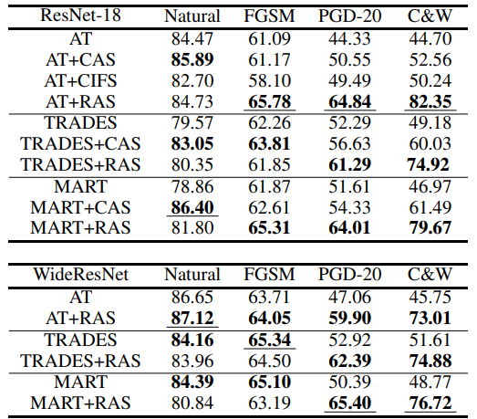

## Element-Wise Activation Scaling (EWAS)
Official code for [Improving Robustness of Convolutional Neural Networks Using Element-Wise Activation Scaling]()


--------------------
### Requirements

- torch==1.6.0
- torchvision==0.7.0
- tqdm

---

### How to run?

First, you need to create one empty folder and name it as `data` to store the dataset.

run the command
```commandline
python AT_with_loss.py --net wrn_ras 
python AT_with_loss.py --net resnet_ras
python MART_with_loss.py --net wrn_ras 
python MART_with_loss.py --net resnet_ras 
python TRADES_with_loss.py --net wrn_ras
python TRADES_with_loss.py --net resnet_ras 
```

The results are stored in folds named with adversarial training methods and name with model name and training lambda.


The results of CIFAR10 as follows:


