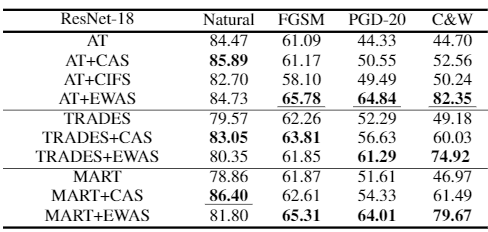

## Element-Wise Activation Scaling (EWAS)
Official code for [Improving Robustness of Convolutional Neural Networks Using Element-Wise Activation Scaling]()


--------------------
### Requirements

- torch==1.6.0
- torchvision==0.7.0
- tqdm
- Part of the code is based on the following repo:
  - TREADES: https://github.com/yaodongyu/TRADES
  - MART: https://github.com/YisenWang/MART
  - FAT: https://github.com/zjfheart/Friendly-Adversarial-Training
---

### How to run?

First, you need to create one empty folder and name it as `data` to store the dataset.

run the command
```commandline
python AT_with_loss.py --net wrn_ewas --lam 0.01
python AT_with_loss.py --net resnet_ewas --lam 0.01
python MART_with_loss.py --net wrn_ewas --lam 0.01
python MART_with_loss.py --net resnet_ewas --lam 0.01 
python TRADES_with_loss.py --net wrn_ewas --lam 0.01
python TRADES_with_loss.py --net resnet_ewas --lam 0.01 
```

The results are stored in folds named with adversarial training methods and name with model name and training lambda.

### Evaluation

run the command
```commandline
python white_box_robust_eval.py --net resnet_ewas --ckps_path ./AT_results/last_resnet_ras_lam0.01.pth.tar --lam 0.01
python white_box_robust_eval.py --net resnet_ewas --ckps_path ./MART_results/last_resnet_ras_lam0.01.pth.tar --lam 0.01
python white_box_robust_eval.py --net resnet_ewas --ckps_path ./TRADES_results/last_resnet_ras_lam0.01.pth.tar --lam 0.01
```

The results of CIFAR10 as follows:


